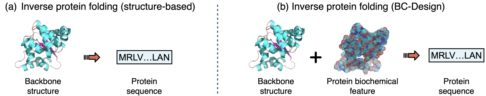
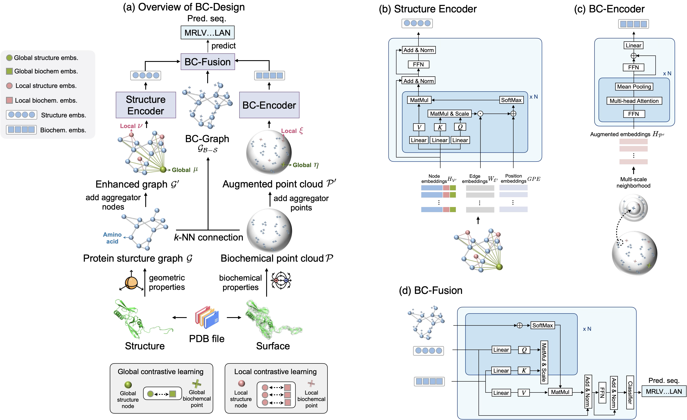

# BC-Design: A Biochemistry-Aware Framework for High-Precision Inverse Protein Folding
<p align="left">
<a href="https://github.com/gersteinlab/BC-Design/blob/public-release/LICENSE" alt="license">
    </a>
<a href="https://github.com/gersteinlab/BC-Design/issues" alt="docs">
    </a>
<a href="https://img.shields.io/github/stars/gersteinlab/BC-Design/" alt="arXiv">
    </a>
</p>

<!-- [📘Documentation](https://openstl.readthedocs.io/en/latest/) |
[🛠️Installation](docs/en/install.md) |
[🚀Model Zoo](docs/en/model_zoos/video_benchmarks.md) |
[🆕News](docs/en/changelog.md) -->

This repository contains the implementation code for the paper:

[**BC-Design: A Biochemistry-Aware Framework for High-Precision Inverse Protein Folding**]

Xiangru Tang<sup>†</sup>, Xinwu Ye</sup>†</sup>, Fang Wu</sup>†</sup>, Daniel Shao, Yin Fang, Siming Chen, Dong Xu, and Mark Gerstein.

<sup>†</sup> Equal contribution



## Introduction

Inverse protein folding aims to design amino acid sequences that form specific 3D structures, which is crucial for protein engineering and drug development. Traditional approaches often neglect vital biochemical characteristics that impact protein function. BC-Design introduces a new approach that combines structural data and biochemical attributes, using a dual-encoder architecture for enhanced accuracy. This framework, which surpasses current methods in sequence recovery and structural precision, demonstrates strong generalization and performs well with complex protein features.

**Key Features of BC-Design:**
  - Integrates structural and biochemical features for protein design.
  - Uses a dual-encoder system with a Structure Encoder for spatial relationships and a BC-Encoder for biochemical features.
  - A BC-Fusion module enables cross-modal feature interaction, enhancing alignment of structural and biochemical data.
  - Outperforms traditional methods with high sequence recovery (88.37%) and low perplexity (1.47) on the CATH 4.2 benchmark.
  - Exhibits robust generalization across diverse protein sizes, complexity levels, and structural classes.

<p align="right">(<a href="#top">back to top</a>)</p>

## Overview

<details open>
<summary>Code Structures</summary>



- `src/datasets` contains datasets, dataloaders, and collate functions
- `src/interface` contains customized Pytorch-lightning data modules and modules.
- `src/models/` contains the main BC-Design model architecture.
- `src/tools` contains some script files of some tools.
- `train` contains the training script.

</details>

## News and Updates

- [🚀 2024-10-30] The official code is released.

## Installation

This project has provided an environment setting file of conda, users can easily reproduce the environment by the following commands:

```shell
git clone https://github.com/gersteinlab/BC-Design.git
cd BC-Design
conda env create -f environment.yml
conda activate opencpd
python setup.py develop
```

## Getting Started

<!-- **Obtaining Dataset**

The processed datasets could be found in the [releases](https://github.com/A4Bio/ProteinInvBench/releases/tag/dataset_release).  -->

**Model Training**

```shell
python train/main_fused.py
```

<p align="right">(<a href="#top">back to top</a>)</p>

## License

This project is released under the [Apache 2.0 license](LICENSE). See `LICENSE` for more information.

<!-- ## Citation -->


## Contribution and Contact

For adding new features, looking for helps, or reporting bugs associated with `BC-Design`, please open a [GitHub issue](https://github.com/gersteinlab/BC-Design/issues) and [pull request](https://github.com/gersteinlab/BC-Design/pulls) with the tag "new features", "help wanted", or "enhancement". Please ensure that all pull requests meet the requirements outlined in our [contribution guidelines](https://github.com/gersteinlab/BC-Design/blob/public-release/CONTRIBUTING.md). Following these guidelines helps streamline the review process and maintain code quality across the project.
Feel free to contact us through email if you have any questions.


<p align="right">(<a href="#top">back to top</a>)</p>
