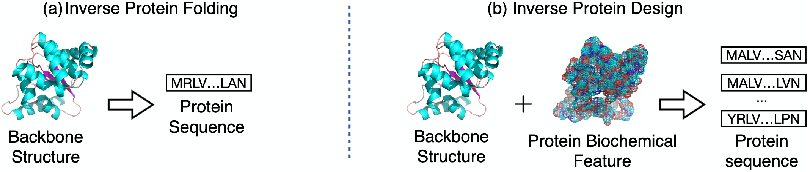
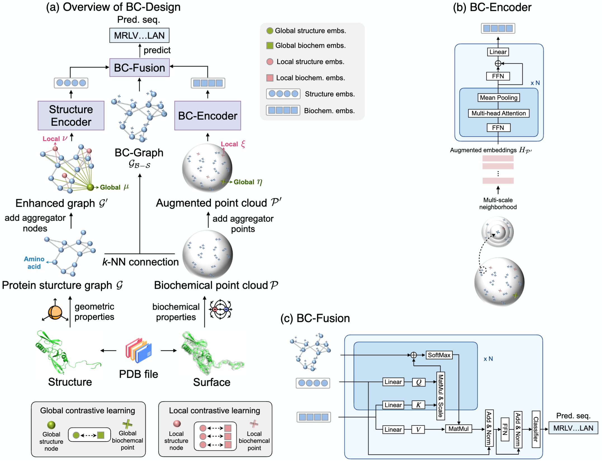

# BC-Design: A Biochemistry-Aware Framework for Inverse Protein Design
<p align="left">
      <a href='https://www.biorxiv.org/content/10.1101/2024.10.28.620755v2'></a>
<a href="https://github.com/gersteinlab/BC-Design/blob/public-release/LICENSE" alt="license">
    </a>
<a href="https://github.com/gersteinlab/BC-Design/issues" alt="docs">
    </a>
<a href="https://img.shields.io/github/stars/gersteinlab/BC-Design/" alt="arXiv">
    </a>
</p>

<!-- [📘Documentation](https://openstl.readthedocs.io/en/latest/) |
[🛠️Installation](docs/en/install.md) |
[🚀Model Zoo](docs/en/model_zoos/video_benchmarks.md) |
[🆕News](docs/en/changelog.md) -->

This repository contains the implementation code for the paper:

[**BC-Design: A Biochemistry-Aware Framework for Inverse Protein Design**]

Xiangru Tang<sup>†</sup>, Xinwu Ye<sup>†</sup>, Fang Wu<sup>†</sup>, Yimeng Liu, Anna Su, Antonia Panescu, Guanlue Li, Daniel Shao, Dong Xu, and Mark Gerstein<sup>*</sup>.

<sup>†</sup> Equal contribution




<!-- ## Introduction

Inverse protein folding aims to design amino acid sequences that form specific 3D structures, which is crucial for protein engineering and drug development. Traditional approaches often neglect vital biochemical characteristics that impact protein function. BC-Design introduces a new approach that combines structural data and biochemical attributes, using a dual-encoder architecture for enhanced accuracy. This framework, which surpasses current methods in sequence recovery and structural precision, demonstrates strong generalization and performs well with complex protein features.

**Key Features of BC-Design:**
  - Integrates structural and biochemical features for protein design.
  - Uses a dual-encoder system with a Structure Encoder for spatial relationships and a BC-Encoder for biochemical features.
  - A BC-Fusion module enables cross-modal feature interaction, enhancing alignment of structural and biochemical data.
  - Outperforms traditional methods with high sequence recovery (88.37%) and low perplexity (1.47) on the CATH 4.2 benchmark.
  - Exhibits robust generalization across diverse protein sizes, complexity levels, and structural classes.

<p align="right">(<a href="#top">back to top</a>)</p> -->

## Overview

<details open>
<summary>Code Structures</summary>



- `src/datasets` contains datasets, featurizer, and utils
- `src/interface` contains customized Pytorch-lightning data modules and modules.
- `src/models/` contains the main BC-Design model architecture.
- `src/tools` contains some script files of some tools.
- `train` contains the training and inference script.

</details>

## News and Updates

- [🆕 2025-11-23] Added backbone-only (BC-Backbone-Only) inference pipeline and scripts.
- [🚀 2024-10-30] The official code is released.


## ⚙️ Installation

This section guides you through setting up the necessary environment and dependencies to run BC-Design.

### Step 1: Prerequisites - CUDA and GCC

Before creating the Conda environment, please ensure your system meets the following requirements. While other versions might also work, our code was developed and tested using the specific versions listed below:

1.  **CUDA Version:** This codebase has been validated on **CUDA 12.8 with NVIDIA driver 570.133.20**, so running on that (or an equivalent, compatible setup) is recommended.
2.  **GCC Compiler:** A C/C++ compiler is needed, specifically **GCC version 12.2.0** or a compatible version. This codebase has been validated on **GCC version 12.2.0**.
    * **Linux:** You can typically install GCC using your system's package manager. For example, on Debian/Ubuntu-based systems, you might use:
        ```shell
        sudo apt update
        sudo apt install gcc-12 g++-12
        ```
        On other distributions, use the appropriate package manager (e.g., `yum`, `dnf`). You may need to configure your system to use this specific version if multiple GCC versions are installed.
    * **HPC Environments:** If you are using a High-Performance Computing (HPC) cluster, GCC is often managed via environment modules. You might load it using a command like:
        ```shell
        module load GCC/12.2.0
        ```
        (The exact command may vary based on your HPC's module system.)
    * **Other Systems (macOS, Windows via WSL2):** Ensure you have a compatible C/C++ compiler. For macOS, Xcode Command Line Tools provide Clang, which is often compatible. For Windows, WSL2 with a Linux distribution is recommended.
4.  **Reference OS:** Development and testing took place on **Red Hat Enterprise Linux 8.10 (Ootpa)**. Other modern Linux distributions should work fine as long as the CUDA/GCC requirements above are satisfied.

### Step 2: Create Conda Environment

This project has provided an environment setting file for **Miniconda3**. Users can easily reproduce the Python environment by following these commands:

```shell
git clone https://github.com/gersteinlab/BC-Design.git
cd BC-Design
conda env create -f environment.yml -n [your-env-name]
conda activate [your-env-name]
````

Replace `[your-env-name]` with your preferred name for the Conda environment (e.g., `bcdn`).

### Step 3: Download Data and Model Checkpoint

To train the model, you need to download the preprocessed data.
To test with the released model weights, you should also download the checkpoint.

1.  Navigate to the Hugging Face project page: [https://huggingface.co/datasets/XinwuYe/BC-Design/tree/main](https://huggingface.co/datasets/XinwuYe/BC-Design/tree/main)
2.  Download the following files into the `BC-Design` folder (the main directory cloned from GitHub):
      * `data.zip` (contains data for training and testing)
      * `UBC2Model.ckpt` (the checkpoint for testing, download it only when you want to test with the releases model weights)
3.  Once downloaded, unzip the data file:
    ```shell
    unzip data.zip
    ```
    This should create a `data/` directory inside your `BC-Design` folder.

As an alternative, you can also run the following commands:
```shell
wget https://huggingface.co/datasets/XinwuYe/BC-Design/resolve/main/data.zip?download=true -O data.zip
unzip data.zip
wget "https://huggingface.co/datasets/XinwuYe/BC-Design/resolve/main/UBC2Model.ckpt?download=true" -O UBC2Model.ckpt
````

After completing these steps, your environment should be ready, and you'll have the necessary data (and model checkpoint) to proceed with using BC-Design.


## Getting Started

### Evaluate on CATH 4.2:

The `train/main_eval.py` script is used to evaluate the trained BC-Design model on test datasets. It loads the specified dataset and the model checkpoint (`UBC2Model.ckpt` by default) to perform inference and report evaluation metrics.

Note: `train/main_eval.py` computes structure-level metrics via ESMFold. For very large proteins, ESMFold may run out of GPU memory and fall back to CPU-based structure prediction, which significantly increases runtime. The commands below include rough runtime estimates; TS50 is the fastest dataset to reproduce the evaluation.

To test on the test set of CATH4.2:
```shell
python train/main_eval.py --dataset CATH4.2 # ~3.5 hours on 1 A100 GPU
# Expected output: many metrics
```
To test on TS50, TS500, or AFDB2000:
```shell
python train/main_eval.py --dataset TS50 # ~2 mins on 1 A100 GPU
python train/main_eval.py --dataset TS500 # ~9 hours on 1 A100 GPU
python train/main_eval.py --dataset AFDB2000
```
To test with backbone-structure-only inference:
```shell
python train/main_eval.py --if_struc_only True --dataset [dataset-name]
```
To test the model under partial-information settings (i.e., masking a chosen portion of the biochemical features):
```shell
python train/main_eval.py --exp_bc_mask_rate 0.6 --dataset [dataset-name] # mask 60% of biochemical features in the input
```

**Key functionalities of `main_eval.py`:**
-   **Dataset Selection:** You can specify the dataset for evaluation using the `--dataset` argument (e.g., `CATH4.2`, `TS50`, `TS500`, `AFDB2000`).
-   **Checkpoint Loading:** It loads a pre-trained model from the path specified by `--checkpoint_path` (defaults to `./UBC2Model.ckpt`).
-   **Evaluation Metrics:** The script calculates and displays various performance metrics such as test loss, sequence recovery, perplexity, pLDDT, and TM-score.
-   **Configurable Parameters:** Several aspects of the evaluation can be configured through command-line arguments, including:
    * `--res_dir`: Directory to store results.
    * `--batch_size`: Batch size for evaluation.
    * `--data_root`: Root directory of the dataset.
    * `--num_workers`: Number of workers for data loading.
    * For a full list of arguments and their default values, you can refer to the `create_parser()` function within the `train/main_eval.py` script.

The predicted protein sequences will be saved under `predicted_pdb/[ex_name]/[dataset]`.

### Training Model

Run the following commamds to reproduce training BC-Design on the CATH 4.2 training set. The model checkpoint will be saved as `./train/results/UBC2ModelReproduced/checkpoints/last.ckpt`.

```shell
python train/main.py \
  --lr 0.001 \
  --if_strucenc_only True \
  --ex_name UBC2ModelStage1  # stage 1
  
python train/main.py \
  --lr 0.0005 \
  --contrastive_learning True \
  --contrastive_pretrain True \
  --checkpoint_path "./train/results/UBC2ModelStage1/checkpoints/last.ckpt" \
  --ex_name UBC2ModelStage2  # stage 2

python train/main.py \
  --lr 0.0005 \
  --if_warmup_train True \
  --checkpoint_path "./train/results/UBC2ModelStage2/checkpoints/last.ckpt" \
  --ex_name UBC2ModelStage3  # stage 3

python train/main.py \
  --lr 0.00002 \
  --lr_scheduler cosine \
  --bc_mask_max_rate 3.0 \
  --checkpoint_path "./train/results/UBC2ModelStage3/checkpoints/last.ckpt" \
  --ex_name UBC2ModelReproduced  # stage 4
```

### Data Preparation

If you’d like to use BC-Design on your own data, run this command to convert your .pdb files into the format BC-Design expects:
```shell
python pdb2jsonpkl.py --pdb_folder [dir-of-pdb-files] --dataset_name [dataset-name]
```
After running it, the processed data will be saved in `.data/[dataset-name]`, and the `[dataset-name]` can be used directly as the `dataset` argument for `train/main_eval.py`.

<p align="right">(<a href="#top">back to top</a>)</p>

## License

This project is released under the [Apache 2.0 license](LICENSE). See `LICENSE` for more information.

<!-- ## Citation -->


## Contribution and Contact

For adding new features, looking for helps, or reporting bugs associated with `BC-Design`, please open a [GitHub issue](https://github.com/gersteinlab/BC-Design/issues) and [pull request](https://github.com/gersteinlab/BC-Design/pulls) with the tag "new features", "help wanted", or "enhancement". Please ensure that all pull requests meet the requirements outlined in our [contribution guidelines](https://github.com/gersteinlab/BC-Design/blob/public-release/CONTRIBUTING.md). Following these guidelines helps streamline the review process and maintain code quality across the project.
Feel free to contact us through email if you have any questions.


<p align="right">(<a href="#top">back to top</a>)</p>
